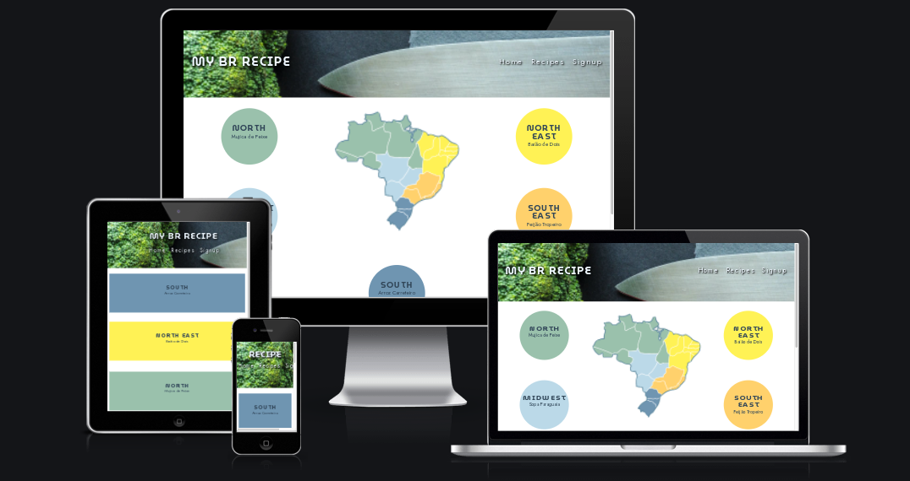
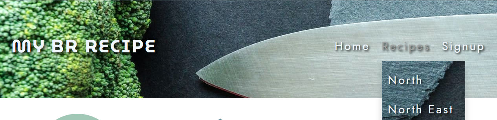
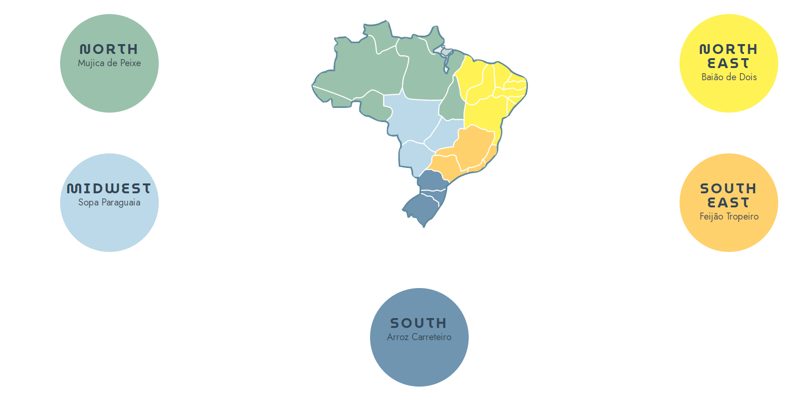
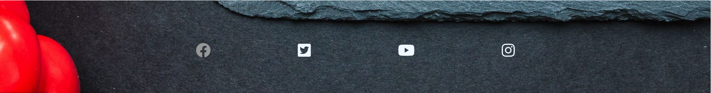
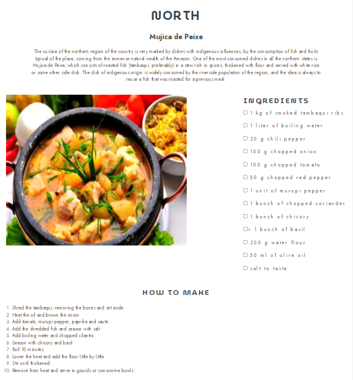
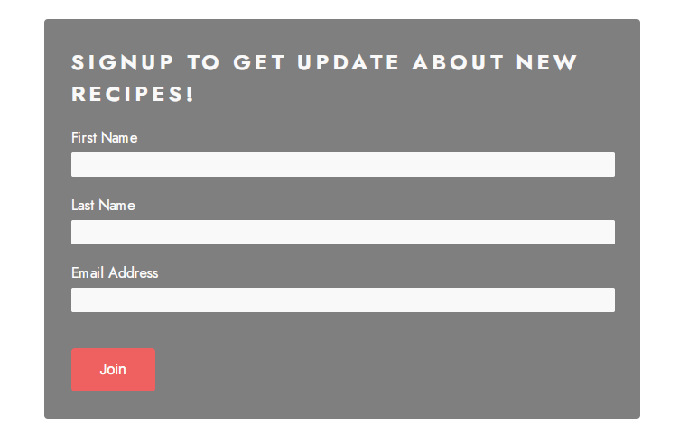
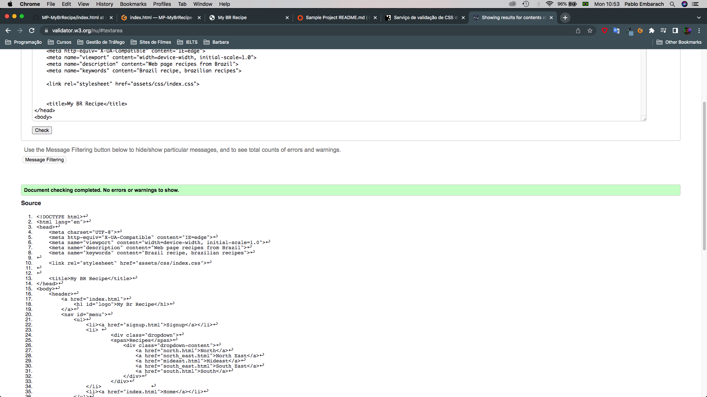
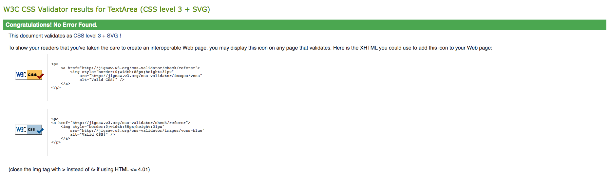

# My Br Recipe

>Project developed for the Full Stack Developer - Code Institute course, using only HTML and CSS to build a static webpage.

>The purpose of this webpage is to promote a bit of Brazilian culinary culture, presenting typical dishes from each region of Brazil. 5 different dishes are presented along with the recipe to prepare them, with a list of items and method of preparation. It also has a singup page for a newsletter (which doesn't actually exist).

## Features

* ### Navigation Bar
    - Featured on all three pages, the full responsive navigation bar includes links to the Logo, Home page, Recipes which have a dropdown menu with 5 pages and Sign Up page and is identical in each page to allow for easy navigation.
    - This section will allow the user to easily navigate from page to page across all devices without having to revert back to the previous page via the ‘back’ button.

* ### The landing page
    - The landing includes a map of Brazil divided into regions with side match colorful buttons which allows the user to navigate to the recipe pages quickly.
    - The buttons have a small animation that lets the user know exactly which page he will be directed to.

* ### The footer
    - The footer section includes links to the relevant social media sites for My Br Recipe. The links will open to a new tab to allow easy navigation for the user.
    - The footer is valuable to the user as it encourages them to keep connected via social media.

* ### Recipe
    - On this page the user can see an image of the dish, a list of items with a checkbox to help identify the items that she already has or does not have to make the recipe and a list with the order of preparation of the recipe.
    - This section helps the user to get an overview of what the dish in question looks like, a shopping list and instructions on how to prepare the dish.

* ### The Sign Up Page
    - This page allows the user to sign up to receive a My Recipe newsletter, with updates, tips and new recipes. The user will be asked to submit their full name and email address.

## Testing
- HTML
- No errors were returned when passing through the official [W3C validator](https://validator.w3.org/#validate_by_input).

- CSS
- No errors were found when passing through the official [(Jigsaw) validator](https://jigsaw.w3.org/css-validator/).

- Unfixed Bugs
- There are some responsive bugs in the CSS file that haven't identified the location of the error yet.

## Deployment
- The site was deployed to GitHub pages. The steps to deploy are as follows:
- In the GitHub repository, navigate to the Settings tab
- From the source section on the left menu, select the Pages
- From the source section drop-down menu, select the Main Branch
- Once the main branch has been selected and the save button pressed, the page will be automatically refreshed with a detailed ribbon display to indicate the successful deployment.
The live link can be found here - (https://pembarach.github.io/MP-MyBrRecipe/index.html).

## Credits
- ### Content
- The recipe content was taken from [this website](https://www.maxmilhas.com.br/blog/dicas-de-viagem/pratos-tipicos-das-cinco-regioes-brasileiras).
- Instructions on how to implement the dropdown menu was taken from [this website](https://www.w3schools.com/css/css_dropdowns.asp).
- Instructions on how to implement the region buttons was taken from [this website](https://thomas.vanhoutte.be/miniblog/making-a-div-element-clickable-in-html/#:~:text=We%20simply%20add%20the%20onlcick,make%20the%20whole%20div%20clickable.).
- ### Media
- The photos used on the home and sign up page are from [This Open Source site](https://www.pexels.com/pt-br/) and also from [this wesite](https://www.maxmilhas.com.br/blog/dicas-de-viagem/pratos-tipicos-das-cinco-regioes-brasileiras).
        
